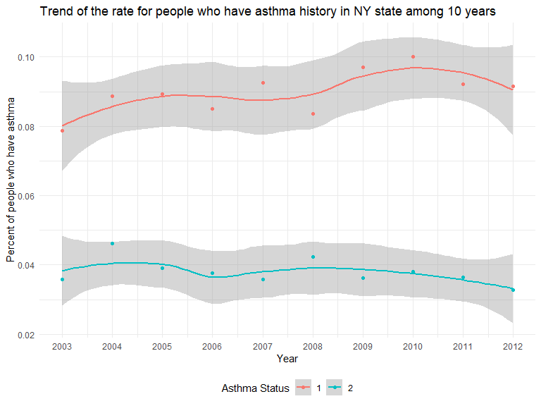
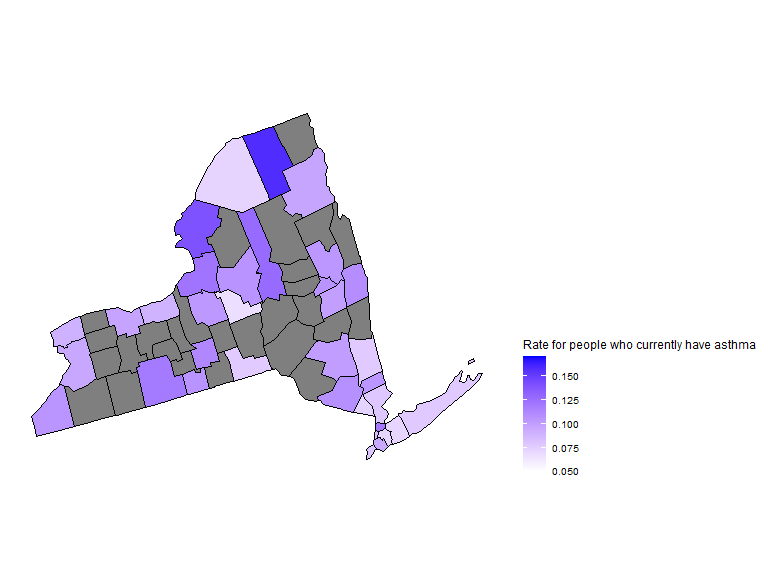
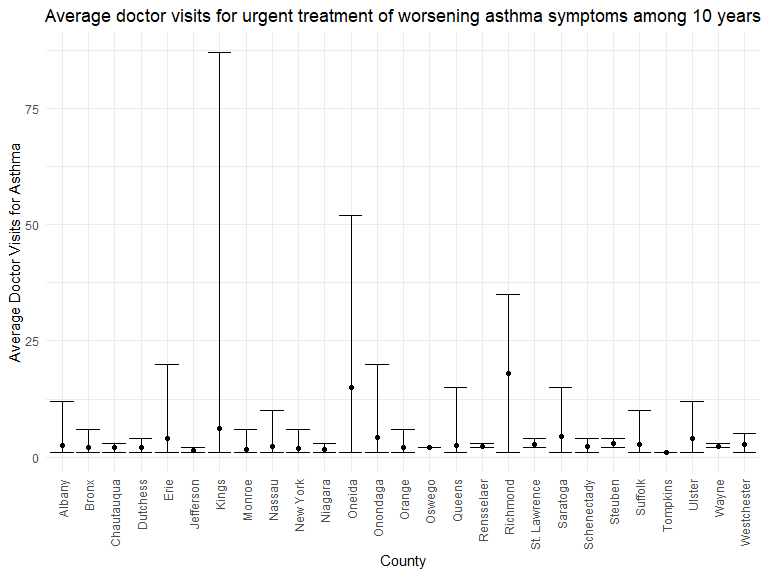
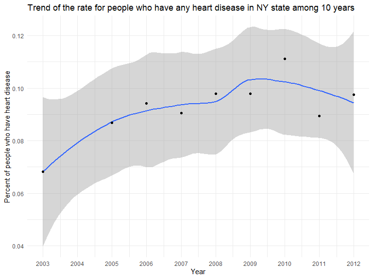
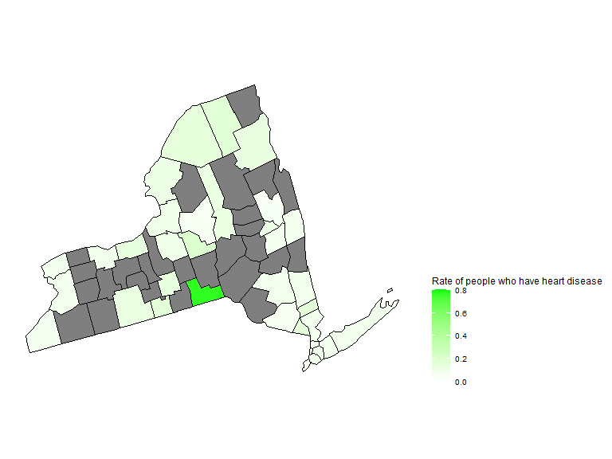

Asthma and heart disease in NY state - from BRFSS
================

### Data Loading

``` r
brfss_air_df = 
  read_csv("./data/brfss_with_air.csv") %>% 
  drop_na(county) %>% 
  mutate(
    county_code = as.character(county_code)
  )
```

    ## New names:
    ## Rows: 65143 Columns: 48
    ## ── Column specification
    ## ──────────────────────────────────────────────────────── Delimiter: "," chr
    ## (5): county_code, state, county, category, defining_parameter dbl (42): ...1,
    ## ...2, state_code.x, year, month, day, asthma, asthma_now, a... date (1): date
    ## ℹ Use `spec()` to retrieve the full column specification for this data. ℹ
    ## Specify the column types or set `show_col_types = FALSE` to quiet this message.
    ## • `` -> `...1`
    ## • `...1.x` -> `...2`
    ## • `...1.y` -> `...30`

#### Asthma

##### Figure 1: Trend of the rate for people who have asthma history in NY state among 10 years

``` r
asthma_history_df = 
  brfss_air_df %>% 
  mutate(
    fips = str_c(state_code.x,county_code)
  ) %>% 
  group_by(year) %>% 
  count(
    year, asthma_status
  ) %>% 
  mutate(
    percent = n/sum(n),
    asthma_status = as.factor(asthma_status)
  ) %>% 
  drop_na(asthma_status)

asthma_history_graph = 
  asthma_history_df %>% 
  filter(asthma_status != "3") %>% 
  group_by(asthma_status) %>%
  ggplot(aes(x = year, y = percent, group = asthma_status, color = asthma_status)) +
  geom_smooth()+
  geom_point()+
  scale_fill_viridis(option = "viridis")+
  labs(
    title = "Trend of the rate for people who have asthma history in NY state among 10 years",
    x = "Year",
    y = "Percent of people who have asthma",
    color = "Asthma Status"
  ) +
  scale_x_continuous(breaks = 2003:2012 )

asthma_history_graph
```

    ## `geom_smooth()` using method = 'loess' and formula 'y ~ x'



##### Figure 2: Map of the rate for people who currently have asthma among 10 years

``` r
asthma_now_county_df = 
  brfss_air_df %>% 
  mutate(
    fips = str_c(state_code.x,county_code)
  ) %>% 
  group_by(state_code.x, county_code,county,fips) %>% 
  count(
    county,asthma_status
  ) %>% 
  mutate(
    percent = n/sum(n)
  ) %>% 
  filter(asthma_status == "1") %>% 
  spread(asthma_status, percent)

asthma_now_county_plot_map = 
  plot_usmap(regions = "county", include = c("NY"), data = asthma_now_county_df, values = "1") +
  scale_fill_continuous(
    low = "white", high = "Blue", name = "Rate for people who currently have asthma", label = scales::comma, limits = c(0.05,0.17)
  ) + 
  theme(legend.position = "right")

asthma_now_county_plot_map
```



##### Figure 3: Trend of average doctor visits for urgent treatment of worsening asthma symptoms in counties among 10 years

``` r
asthma_visit_df = 
  brfss_air_df %>% 
  drop_na(asthma_visit) %>% 
  filter(asthma_visit != 0) %>% 
  group_by(state_code.x, county_code,county) %>% 
  summarize(
    mean_asthma_visit = mean(asthma_visit),
    max_asthma_visit = max(asthma_visit),
    min_asthma_visit = min(asthma_visit)
  ) 
```

    ## `summarise()` has grouped output by 'state_code.x', 'county_code'. You can
    ## override using the `.groups` argument.

``` r
asthma_visit_graph = 
  asthma_visit_df %>% 
  mutate(
    county = fct_reorder(county, desc(mean_asthma_visit))
  ) %>% 
  ggplot(aes(x = county, y = mean_asthma_visit)) +
  geom_point()+
  geom_errorbar(mapping = aes(ymin = min_asthma_visit, ymax = max_asthma_visit )) +
  labs( x = "County",  y = "Average Doctor Visits for Asthma", title = "Average doctor visits for urgent treatment of worsening asthma symptoms among 10 years") + 
  theme(plot.title = element_text(hjust = 0.5)) + 
  theme(axis.text.x = element_text(angle = 90, vjust = 0.5, hjust = 1))

asthma_visit_graph
```



#### Heart disease

##### Figure 4: Trend of the rate for people who have any heart disease in NY state among 10 years

``` r
hd_history_df = 
  brfss_air_df %>% 
  mutate(
    fips = str_c(state_code.x,county_code),
    heart_disease = ifelse(coronary_heart_disease == "1" | heart_attack == "1" | stroke == "1", "1", "0")
  ) %>% 
  group_by(year) %>% 
  count(
    year, heart_disease
  ) %>% 
  mutate(
    percent = n/sum(n),
    heart_disease = as.factor(heart_disease)
  ) %>% 
  drop_na(heart_disease)

hd_history_graph = 
 hd_history_df %>% 
  filter(heart_disease == "1") %>% 
  ggplot(aes(x = year, y = percent)) +
  geom_smooth()+
  geom_point()+
  scale_fill_viridis(option = "viridis")+
  labs(
    title = "Trend of the rate for people who have any heart disease in NY state among 10 years",
    x = "Year",
    y = "Percent of people who have heart disease"
  ) +
  scale_x_continuous(breaks = 2003:2012 )

hd_history_graph
```

    ## `geom_smooth()` using method = 'loess' and formula 'y ~ x'



##### Figure 5: Map of the rate for people who have heart disease among 10 years

``` r
hd_county_df = 
  brfss_air_df %>% 
  mutate(
    fips = str_c(state_code.x,county_code),
    heart_disease = ifelse(coronary_heart_disease == "1" | heart_attack == "1" | stroke == "1", "1", "0")
  ) %>% 
  group_by(state_code.x, county_code,county,fips) %>% 
  count(
    year, heart_disease
  ) %>% 
  mutate(
    percent = n/sum(n),
    heart_disease = as.factor(heart_disease)
  ) %>% 
  drop_na(heart_disease)

hd_county_plot_map = 
  plot_usmap(regions = "county", include = c("NY"), data = hd_county_df, values = "percent") +
  scale_fill_continuous(
    low = "white", high = "Green", name = "Rate of people who have heart disease", label = scales::comma, limits = c(0,0.8)
  ) + 
  theme(legend.position = "right")

hd_county_plot_map 
```


