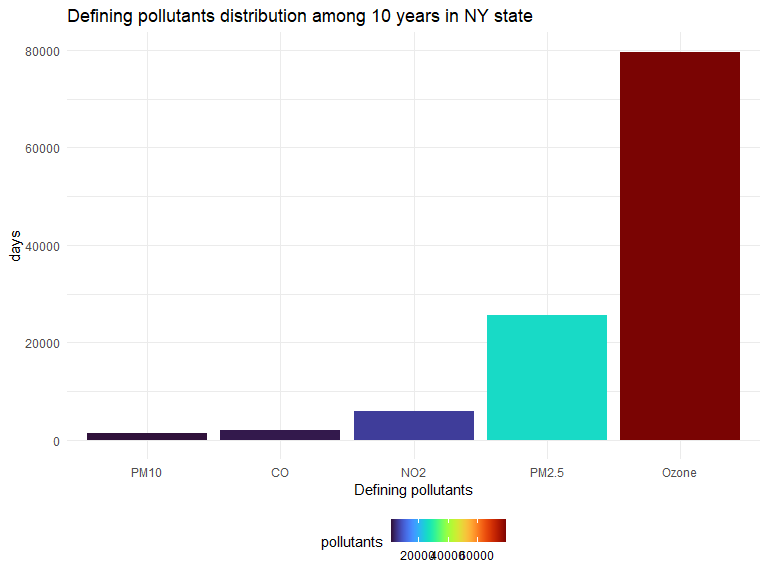
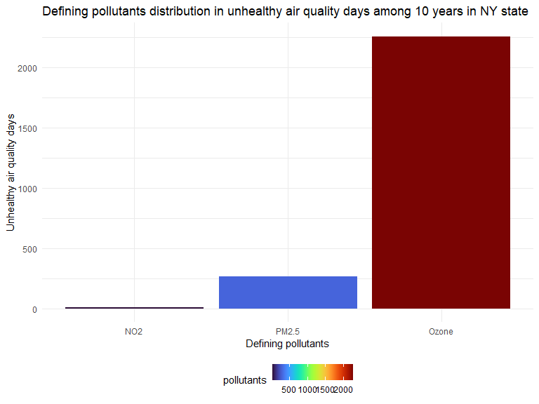
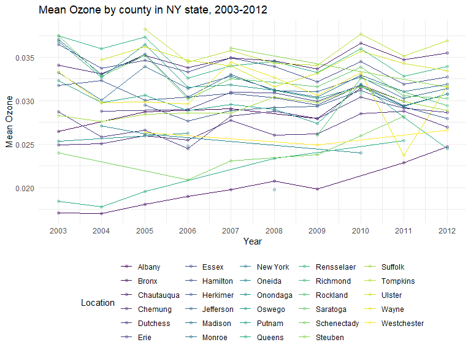
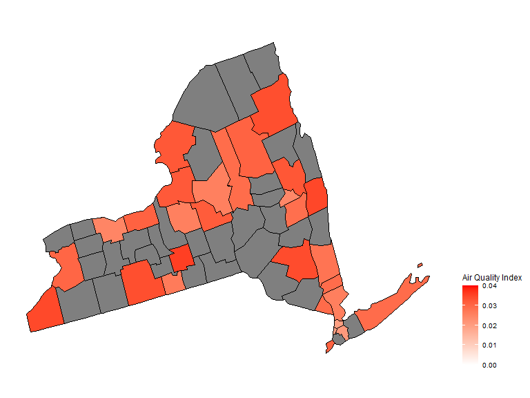
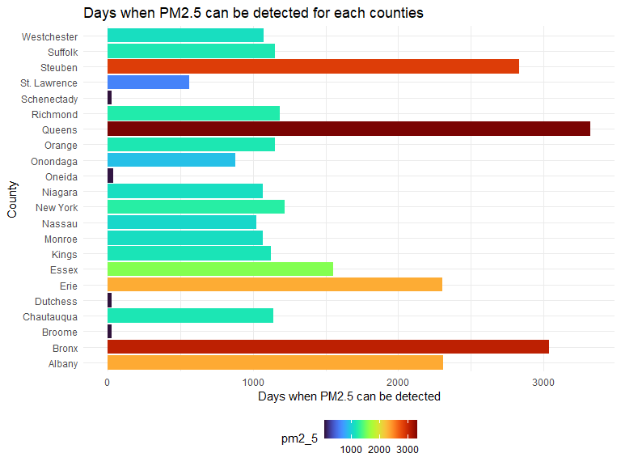
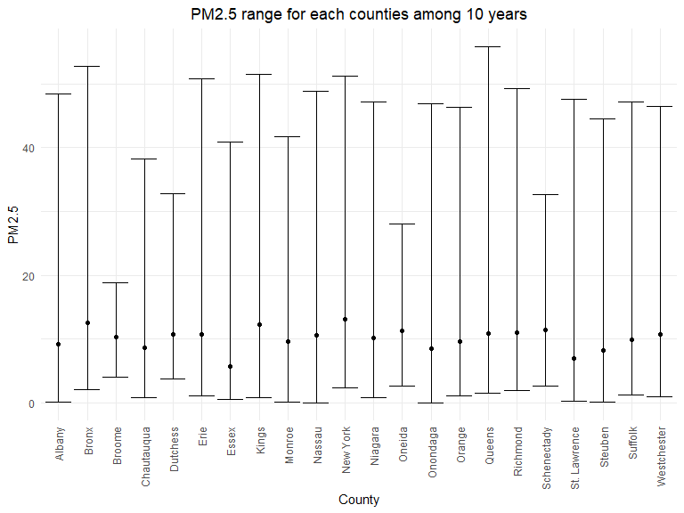

Type of Pollutants in each counties
================

#### Load the data

``` r
air_daily_df = 
  read_csv("./data/air_daily.csv") %>% 
  separate(col = date, into = c('year','month','day'), sep = "-" , convert = TRUE) %>% 
  drop_na(aqi) %>% 
  drop_na(county)
```

    ## New names:
    ## Rows: 114549 Columns: 21
    ## ── Column specification
    ## ──────────────────────────────────────────────────────── Delimiter: "," chr
    ## (5): county_code, state, county, category, defining_parameter dbl (15): ...1,
    ## state_code, aqi, mean_ozone, max_ozone, mean_co, max_co, me... date (1): date
    ## ℹ Use `spec()` to retrieve the full column specification for this data. ℹ
    ## Specify the column types or set `show_col_types = FALSE` to quiet this message.
    ## • `` -> `...1`

#### Calculation

``` r
aqi_year_df = 
  air_daily_df %>% 
  select(state_code, county_code, state, county, year, aqi) %>% 
  group_by(state_code, county_code,county,year) %>% 
  summarize(
    aqi_mean = mean(aqi)
  )
```

    ## `summarise()` has grouped output by 'state_code', 'county_code', 'county'. You
    ## can override using the `.groups` argument.

``` r
air_county_df = 
  aqi_year_df %>% 
  group_by(state_code, county_code,county) %>% 
  summarize(
    aqi_all = mean(aqi_mean),
    max = max(aqi_mean),
    min = min(aqi_mean)
  ) %>% 
  mutate(
    fips = str_c(state_code,county_code)
  )
```

    ## `summarise()` has grouped output by 'state_code', 'county_code'. You can
    ## override using the `.groups` argument.

``` r
air_quality_day_df = 
  air_daily_df %>% 
  group_by(state_code, county_code,county) %>% 
  mutate(
    aqi_status = case_when(
      category %in% c("Good", "Moderate") ~ "Healthy",
      category %in% c("Unhealthy for Sensitive Groups", "Unhealthy", "Very Unhealthy") ~ "Unhealthy"
    )
  )
```

#### Figure 5: Defining pollutants distribution

``` r
pollutants_graph = 
  air_quality_day_df %>% 
  group_by(defining_parameter) %>% 
  summarize(
    pollutants = n()
  ) %>%
  mutate(
    defining_parameter = fct_reorder(defining_parameter, pollutants)
    ) %>% 
  ggplot(aes(x = defining_parameter, y = pollutants, fill = pollutants)) +
  geom_col() +
  labs(
    title = "Defining pollutants distribution among 10 years in NY state",
    x = "Defining pollutants",
    y = "days"
  ) +
  scale_fill_viridis(option = "turbo")

pollutants_graph
```



#### Figure 6: Defining pollutants distribution in unhealthy air quality days

``` r
Unhealthy_pollutants_graph = 
  air_quality_day_df %>% 
  filter(aqi_status == "Unhealthy") %>% 
  group_by(defining_parameter) %>% 
  summarize(
    pollutants = n()
  ) %>%
  mutate(
    defining_parameter = fct_reorder(defining_parameter, pollutants)
    ) %>% 
  ggplot(aes(x = defining_parameter, y = pollutants, fill = pollutants)) +
  geom_col() +
  labs(
    title = "Defining pollutants distribution in unhealthy air quality days among 10 years in NY state",
    x = "Defining pollutants",
    y = "Unhealthy air quality days"
  ) +
  scale_fill_viridis(option = "turbo")

Unhealthy_pollutants_graph
```



#### Ozone

##### Figure 7: Defining pollutants distribution in unhealthy air quality days

``` r
ozone_year_df = 
  air_daily_df %>% 
  select(state_code, county_code, state, county, year, mean_ozone) %>% 
  group_by(state_code, county_code,county,year) %>% 
  summarize(
    ozone_mean = mean(mean_ozone)
  ) %>% 
  drop_na(ozone_mean)
```

    ## `summarise()` has grouped output by 'state_code', 'county_code', 'county'. You
    ## can override using the `.groups` argument.

``` r
ozone_graph =
  ozone_year_df %>% 
  group_by(county) %>% 
  ggplot(aes(x = year, y = ozone_mean, color = county)) +
  geom_point(alpha=.3) +
  geom_line() +
  labs(
    title = "Mean Ozone by county in NY state, 2003-2012",
    x = "Year",
    y = "Mean Ozone"
  )+
  scale_x_continuous(breaks = 2003:2012 )+
  scale_color_viridis(
    name = "Location", 
    discrete = TRUE
  )

ozone_graph
```



#### Figure 8: Map for ozone in NY state

``` r
ozone_county_df = 
  ozone_year_df %>% 
  group_by(state_code, county_code,county) %>% 
  summarize(
    ozone_all = mean(ozone_mean),
    max = max(ozone_mean),
    min = min(ozone_mean)
  ) %>% 
  mutate(
    fips = str_c(state_code,county_code)
  )
```

    ## `summarise()` has grouped output by 'state_code', 'county_code'. You can
    ## override using the `.groups` argument.

``` r
ozone_county_plot_map = 
  plot_usmap(regions = "county", include = c("NY"), data = ozone_county_df, values = "ozone_all") +
  scale_fill_continuous(
    low = "white", high = "Red", name = "Air Quality Index", label = scales::comma, limits = c(0,0.04)
  ) + 
  theme(legend.position = "right")

ozone_county_plot_map
```



#### PM2.5

##### Figure 9: Days when PM2.5 can be detected for each counties

``` r
pm2_5_county_df = 
  air_daily_df %>% 
  select(state_code, county_code, state, county, year, mean_pm2_5) %>% 
  drop_na(mean_pm2_5) %>% 
  group_by(state_code, county_code,county) %>% 
  summarize(
    pm2_5 = n(),
    pm2_5_all = mean(mean_pm2_5),
    max = max(mean_pm2_5),
    min = min(mean_pm2_5)
  ) 
```

    ## `summarise()` has grouped output by 'state_code', 'county_code'. You can
    ## override using the `.groups` argument.

``` r
pm2_5_county_graph = 
  pm2_5_county_df %>% 
  group_by(county) %>% 
  mutate(county = fct_reorder(county, pm2_5)) %>%
  ggplot(aes(y = county, x = pm2_5, fill = pm2_5)) +
  geom_col() +
  labs(
    title = "Days when PM2.5 can be detected for each counties",
    x = "Days when PM2.5 can be detected",
    y = "County"
  ) +
  scale_fill_viridis(option = "turbo")
  
  pm2_5_county_graph
```



##### Figure 10: PM2.5 range for each counties among 10 years

``` r
pm2_5_county_range_graph =   
  pm2_5_county_df %>% 
  group_by(county) %>% 
  mutate(county = fct_reorder(county, pm2_5_all)) %>% 
  ggplot(aes(x = county, y = pm2_5_all)) +
  geom_point()+
  geom_errorbar(mapping = aes(ymin = min, ymax = max)) +
  labs( x = "County",  y = "PM2.5", title = "PM2.5 range for each counties among 10 years") + 
  theme(plot.title = element_text(hjust = 0.5)) + 
  theme(axis.text.x = element_text(angle = 90, vjust = 0.5, hjust = 1))

pm2_5_county_range_graph
```


